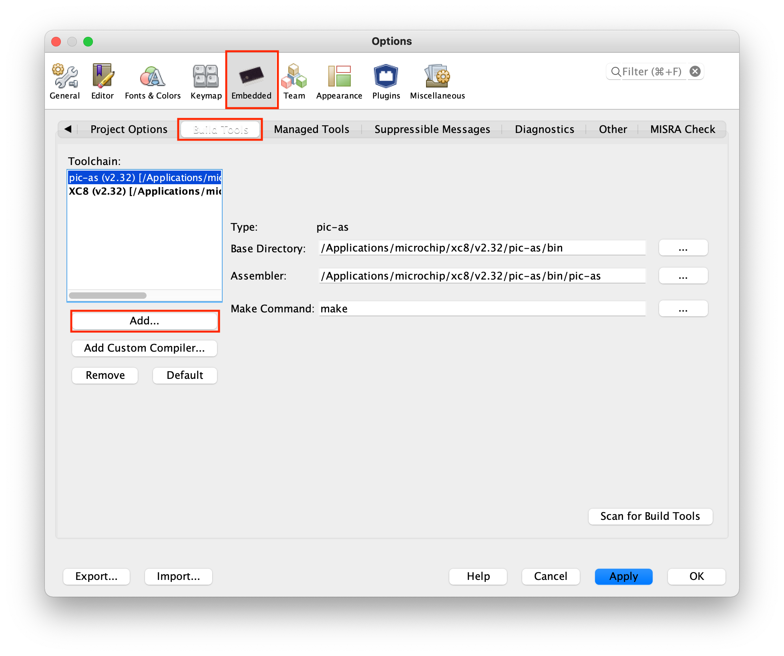
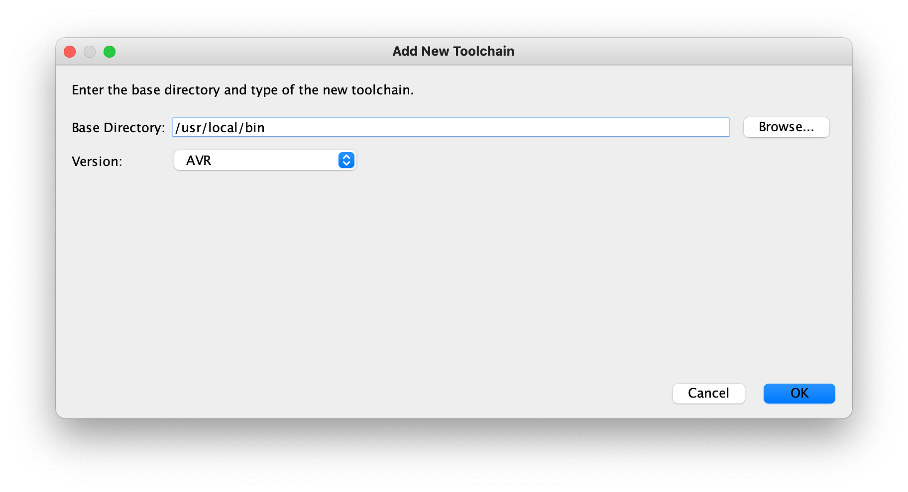
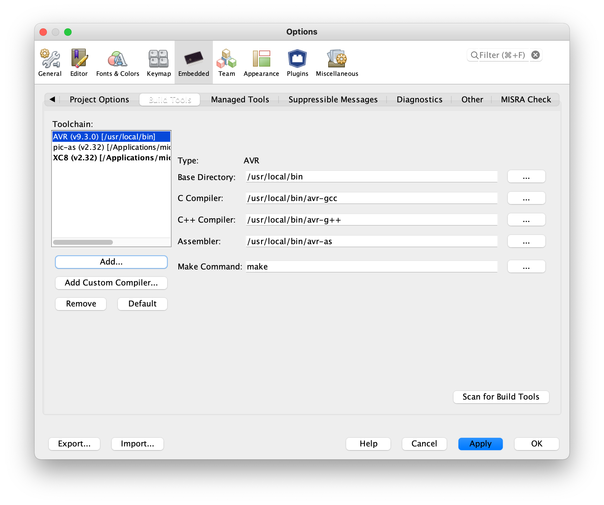

# Verwendung von AVR-GCC unter MPLAB X IDE

Innerhalb der MPLAB X IDE können verschiedene Compiler verwendet werden. Für die meisten ist der [XC8-Compiler](https://www.microchip.com/en-us/development-tools-tools-and-software/mplab-xc-compilers#tabs) für 8-Bit-Systeme von Microchip sicher die beste Wahl. Allerdings können wahlweise auch andere Compiler innerhalb der Entwicklungsumgebung genutzt werden. Dazu zählen:

- [AVR-GCC](https://gcc.gnu.org/wiki/avr-gcc)
- [IAR for AVR](https://www.iar.com/ewavr)

Im folgenden wird die Einbindung des AVR-GCC beschrieben.

## AVR-GCC für MacOS

Am einfachsten lässt sich die `avr-gcc`-Toolchain unter MacOS mittels [Homebrew](https://brew.sh) instllieren. Geben Sie dazu im Terminal folgendes ein:

```bash
> brew install avr-gcc
```

Nach erfolgreicher Installation ist die Toolchain nutzbar. Prüfen Sie dies durch Eingabe im Terminal:

```bash
> avr-gcc --version

avr-gcc (Homebrew AVR GCC 9.3.0_3) 9.3.0
Copyright (C) 2019 Free Software Foundation, Inc.
This is free software; see the source for copying conditions.  There is NO
warranty; not even for MERCHANTABILITY or FITNESS FOR A PARTICULAR PURPOSE.
````

Nun muss die Toolchain noch in MPLAB X IDE eingebunden werden. Öffnen Sie dazu `MPLAB X IDE` und wählen unter `MPLAB X IDE` ==> `Preferences` aus. Gehe Sie zum Reiter `Embedded` --> `Build Tools`.

Klicken Sie auf `Add...` um eine neue Toolchain hinzuzufügen:



Wählen Sie danach den Pfad aus, in dem sich die Toolchain befindet. Wird AVR-GCC mittels `brew install avr-gcc` installiert, befinden sich die Programme im Ordner `/usr/local/bin`. Klicken Sie anschließend auf `OK`.



MPLAB X IDE fügt automatisch alle entsprechenden Programme hinzu:



Von nun an kann `AVR-GCC` als Toolchain ausgewählt werden.


## AVR-GCC für Linux

Tbd

## AVR-GCC für Windows

Tbd
