# Verwendung des AVR-Assemblers mit MPLAB X IDE

Beschreibung folgt.

### Neues Projekt anlegen

- Verwendung des AVR-GCC als Compiler.
- Anleitung zur Einbindung von AVR-GCC in MPLAB X IDE [hier](../avr_gcc/avr_gcc.md)

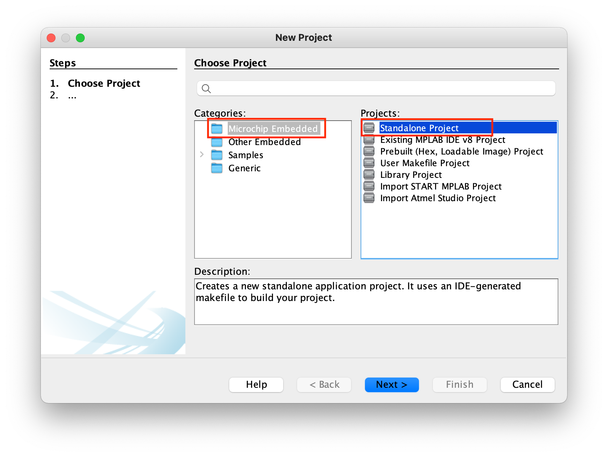

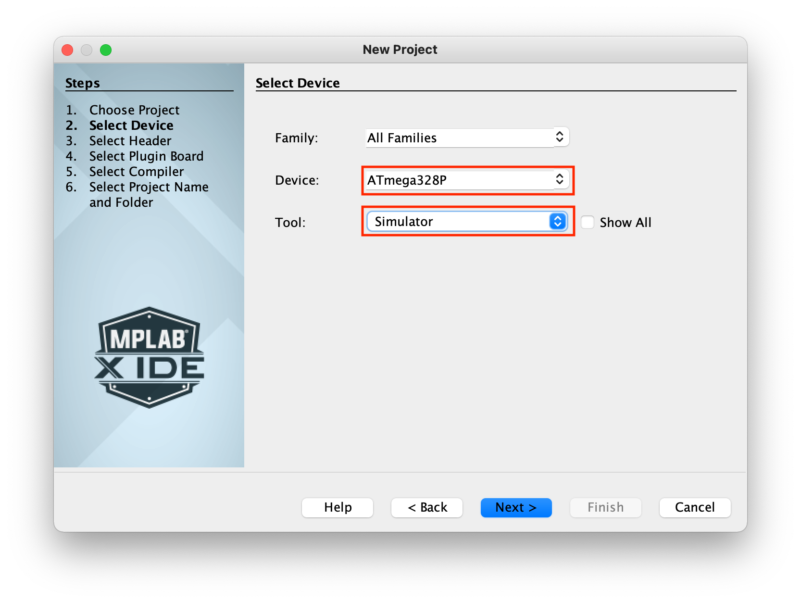

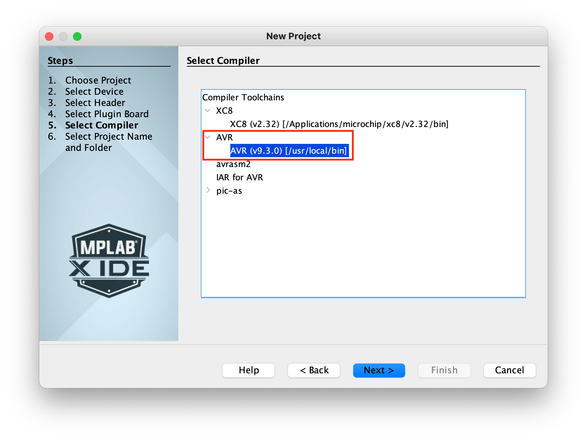

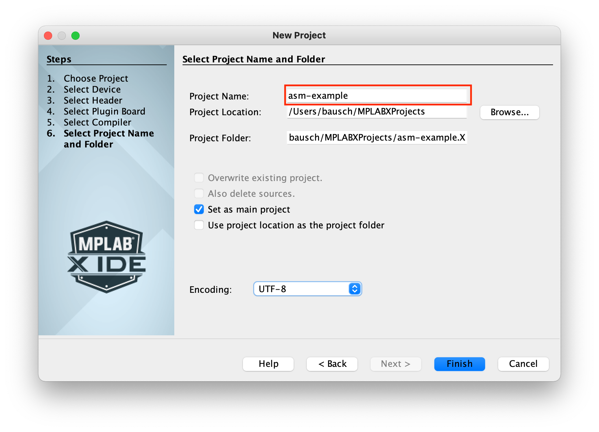

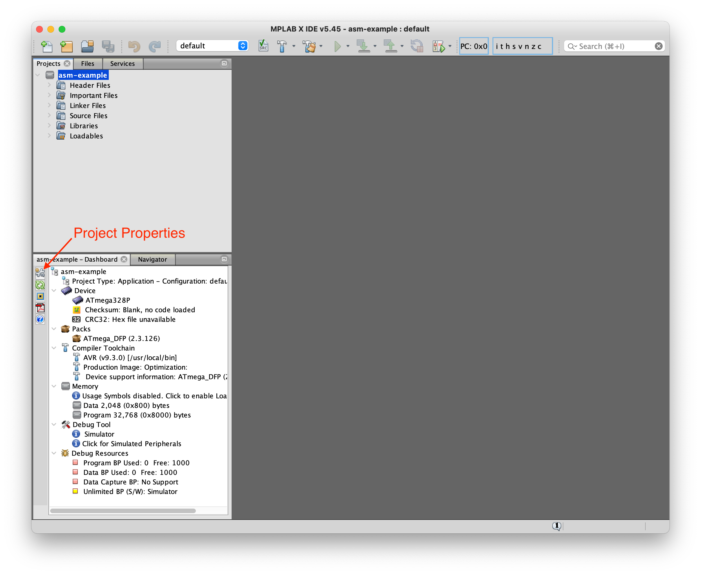

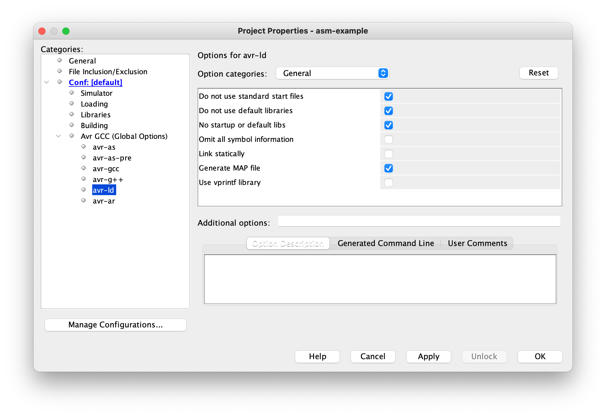

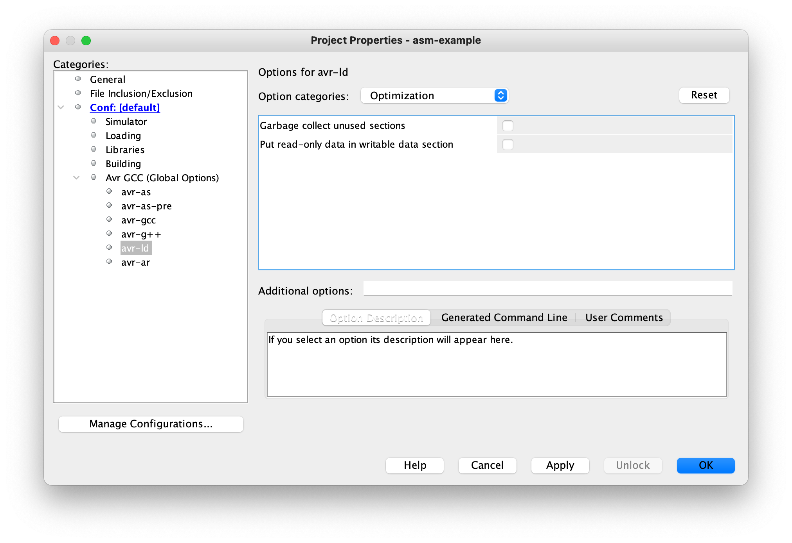

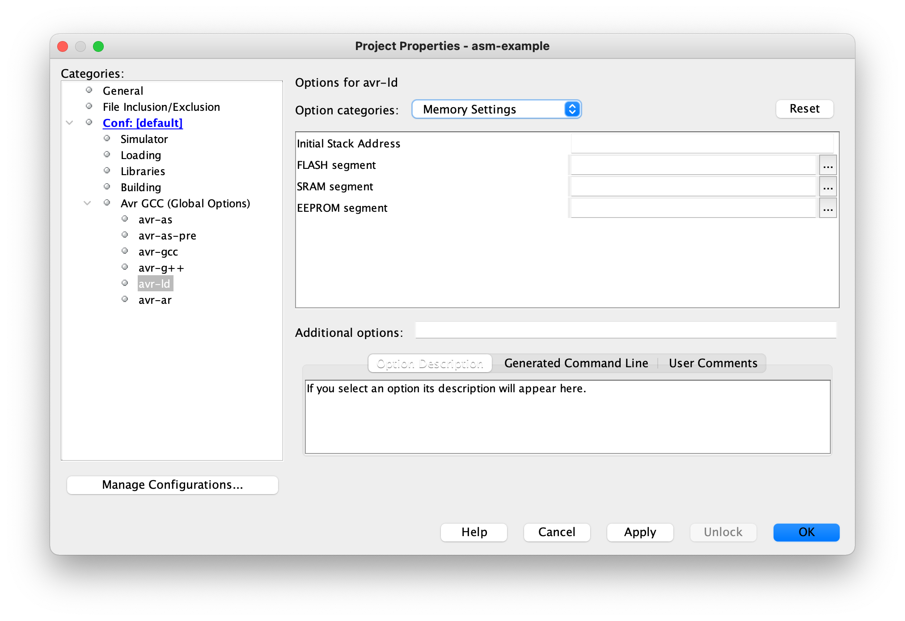

### Neue Quelldatei anlegen

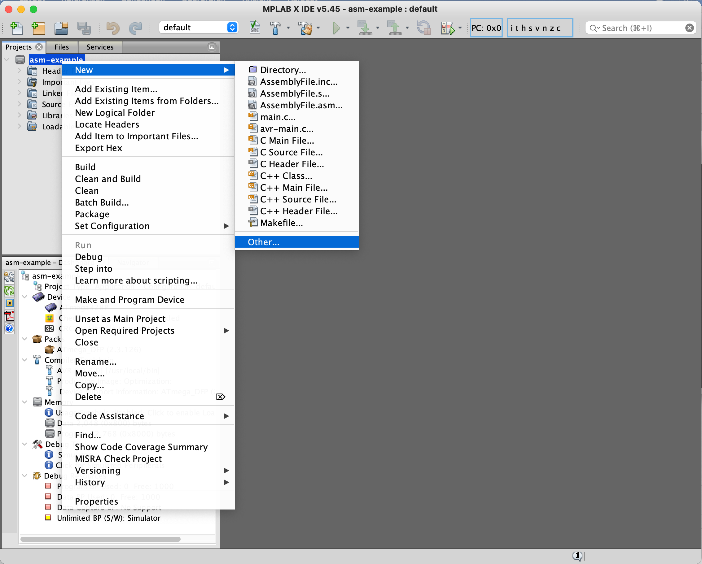

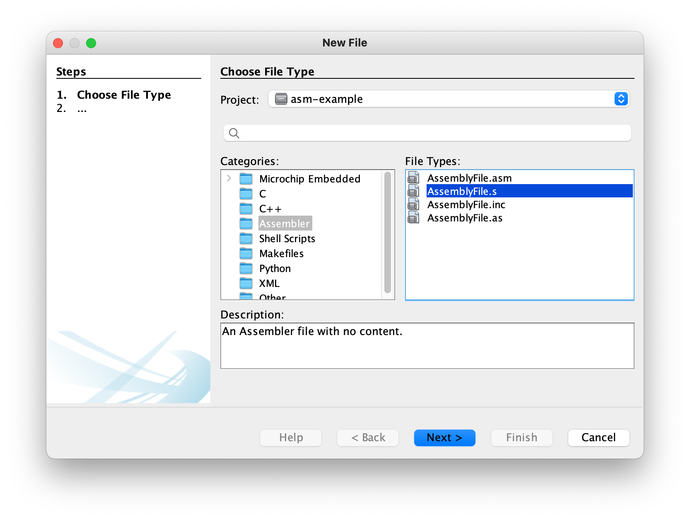

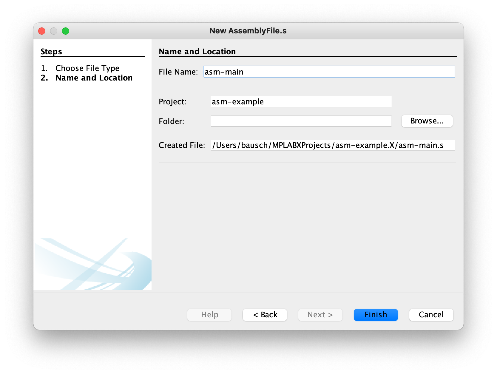

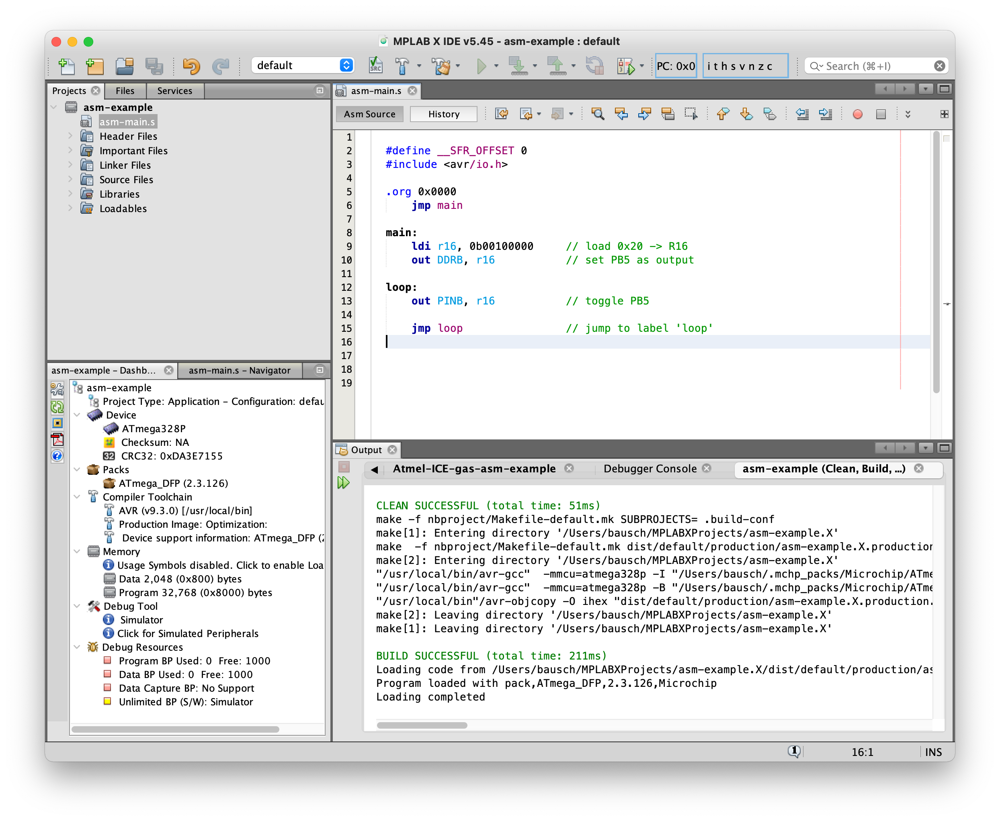